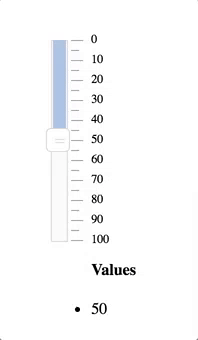

# Typescript Rheostat

> A mobile, tablet, desktop, and accessible slider for the web.
> This is a port of the [Aribnb/rheostat](https://github.com/airbnb/rheostat) project to typescript.




## Install
`yarn add ts-rheostat` or `npm install ts-rheostat`

## Usage

> Important: Make sure to include the [css file](lib/rheostat.css) to your page or 
  use webpack to inline css directly to the page or control. Feel free to create your own styles.

* Simple

```ts
import {Rheostat} from 'ts-rheostat';

ReactDOM.render(<Rheostat />, document.getElementById('slider-root'));
```

* A slider with two handles

```ts
import {Rheostat} from 'ts-rheostat';

ReactDOM.render((
  <Rheostat
    min={1}
    max={100}
    values={[1, 100]}
  />
), document.getElementById('slider-root'));
```

* Vertical 
```ts
import {Rheostat, RheostatOrientation} from 'ts-rheostat';

ReactDOM.render((
  <Rheostat orientation={RheostatOrientation.Vertical} />
), 
document.getElementById('slider-root'));
```

## Live Playground

For more examples you can check out the storybook, which is located in `storybook/ExampleSlider.tsx'

* Clone this repo on your machine.
* `npm install`
* `npm run storybook`
* Visit `http://localhost:9001/`.

## Acknowledgement

All kudos to the Airbnb team and the contributors of the original JSX project [Aribnb/rheostat](https://github.com/airbnb/rheostat)